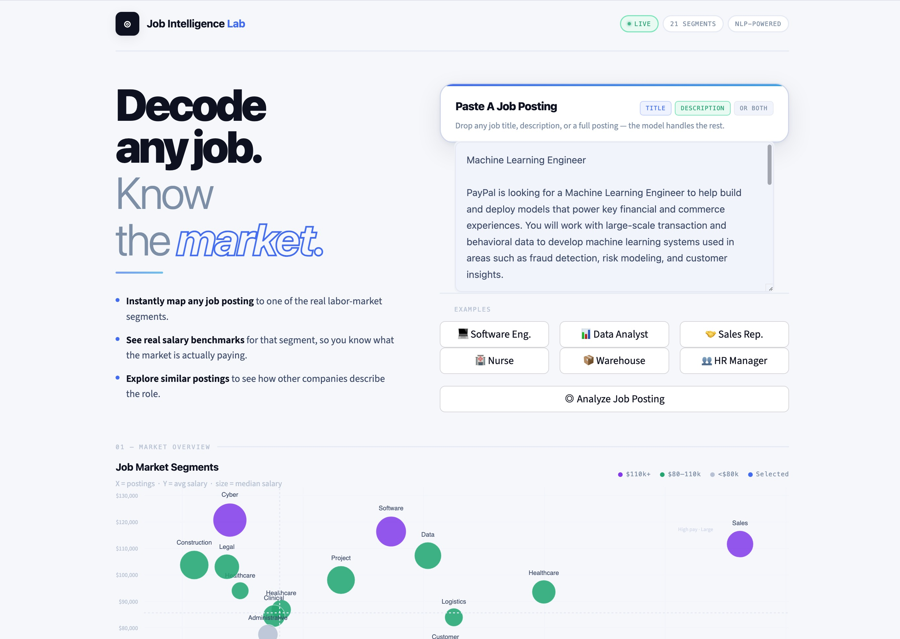

# Job Intelligence Lab  

### NLP-Powered Job Market Segmentation with Semantic Embeddings and Hierarchical Clustering

An end-to-end machine learning pipeline that transforms raw job postings into interpretable job-market segments. The system identifies **21 occupational segments** from LinkedIn job postings and powers an **interactive Streamlit application** for exploring job-market structure, salary benchmarks, and similar roles.

*Live Demo:**  
[Launch the Streamlit App](https://job-intelligence-lab-demo.streamlit.app)

Full modeling pipeline available in:
notebooks/job_market_clustering_pipeline.ipynb

---
## Tech Stack

Python • SentenceTransformers • Scikit-learn • Hugging Face Datasets • NLP • Hierarchical Clustering • Streamlit

---
## Project Highlights

• Built an **NLP pipeline** that converts unstructured job postings into structured labor-market segments
• Embedded job titles and descriptions using **Sentence-Transformers**  
• Clustered job postings using **hierarchical agglomerative clustering**  
• Identified **21 interpretable occupational segments** from real job data  
• Deployed an **interactive Streamlit application** for real-time exploration  

Job postings contain rich information about the labor market, but the text is often inconsistent and difficult to analyze at scale.
This project demonstrates how modern NLP techniques can convert noisy text data into interpretable labor-market intelligence.

---

Dataset: LinkedIn job postings (Hugging Face dataset: datastax/linkedin_job_listings)

---
## Pipeline Overview
Job Postings
     │
     ▼
Text Cleaning
     │
     ▼
SentenceTransformer Embeddings
(title + description)
     │
     ▼
Embedding Fusion
     │
     ▼
Level-1 Agglomerative Clustering (K=10)
     │
     ▼
Cluster Interpretation
     │
     ▼
Level-2 Refinement (Tech + Sales)
     │
     ▼
22 Structural Cluster Paths
     │
     ▼
Semantic Consolidation
     │
     ▼
21 Final Job Segments
     │
     ▼
Market Insights + Demo

---

## Methodology

### 1. Text Embedding

Each job posting is represented using two textual fields:

- job title
- cleaned job description

Both fields are embedded using the **SentenceTransformer model (`all-MiniLM-L6-v2`)**, producing dense semantic vectors.

To better capture job intent, title and description embeddings are combined using a weighted fusion:

\[
X = \alpha \cdot X_{title} + (1-\alpha) \cdot X_{description}
\]

where:

- \( \alpha = 0.75 \)
- embeddings are L2-normalized before and after fusion.

This produces a **384-dimensional semantic representation** for each job posting.

---

### 2. Level-1 Clustering

Agglomerative hierarchical clustering is applied to the fused embeddings to identify high-level job segments.

Parameters:

- clustering method: **Agglomerative Clustering**
- linkage: **complete**
- number of clusters: **K = 10**

This produces **10 coarse job segments**, capturing broad occupational categories such as:

- technology roles
- sales and customer-facing roles
- logistics and warehouse jobs
- healthcare positions
- service occupations

---

### 3. Targeted Level-2 Refinement

Two Level-1 clusters were found to contain **heterogeneous job families**:

- Technology cluster
- Sales cluster

These clusters were further refined using a second round of agglomerative clustering.

Refinement results:

| Parent Cluster | Level-2 Clusters |
|----------------|-----------------|
| Tech           | 8               |
| Sales          | 6               |

The remaining Level-1 clusters were left unchanged.

This hierarchical refinement produced:

- **8 unchanged Level-1 clusters**
- **8 Tech Level-2 clusters**
- **6 Sales Level-2 clusters**

Total structural segments:

**22 cluster paths**

---

### 4. Segment Naming

Each cluster was interpreted using:

- top TF-style keywords extracted from titles and descriptions
- most frequent job titles within the cluster
- contextual hints from parent clusters (Tech / Sales)

A rule-based labeling system maps keyword patterns to interpretable business categories such as:

- Software Engineering
- Data & Business Analytics
- Customer Service / Retail
- Healthcare (Clinical)
- Logistics / Warehouse

Each cluster is assigned a **human-readable segment name**.

---

### 5. Segment Consolidation

During manual review of the labeled clusters, two structurally distinct clusters were found to represent the same occupational category:

- `L1-2`
- `L1-0 > Tech.L2-5`

Both clusters predominantly contained **food service and hospitality jobs** (e.g., servers, kitchen staff, restaurant roles).

These clusters were consolidated into a single business segment:

**Food Service / Hospitality**

As a result:

- **22 structural cluster paths**
- **21 final business segments**

This consolidation step improves interpretability while preserving the underlying clustering structure.

---

### 6. Market Insights Extraction

Finally, labor market statistics are computed for each segment, including:

- number of job postings
- average normalized salary
- median salary

This allows comparison of compensation patterns across occupational segments such as:

- Data & Business Analytics
- Software Engineering
- Healthcare roles
- Service occupations

These insights power the **interactive demo application**.

---

## Repository Structure
The repository contains the deployed Streamlit application and the precomputed artifacts required for real-time job segment classification.
.
├── artifacts/              # Precomputed embeddings and clustering artifacts
│   ├── df_all.parquet
│   ├── X_fused.npy
│   └── segment_centroids.npz
│
├── assets/                 # Images and demo screenshots
│   └── demo_screenshot.jpg
│
├── notebooks/
│   └── job_market_clustering_pipeline.ipynb
│
├── app.py                  # Streamlit application for interactive exploration
├── requirements.txt        # Python dependencies
├── runtime.txt             # Python version for Streamlit deployment
│
├── LICENSE
└── README.md